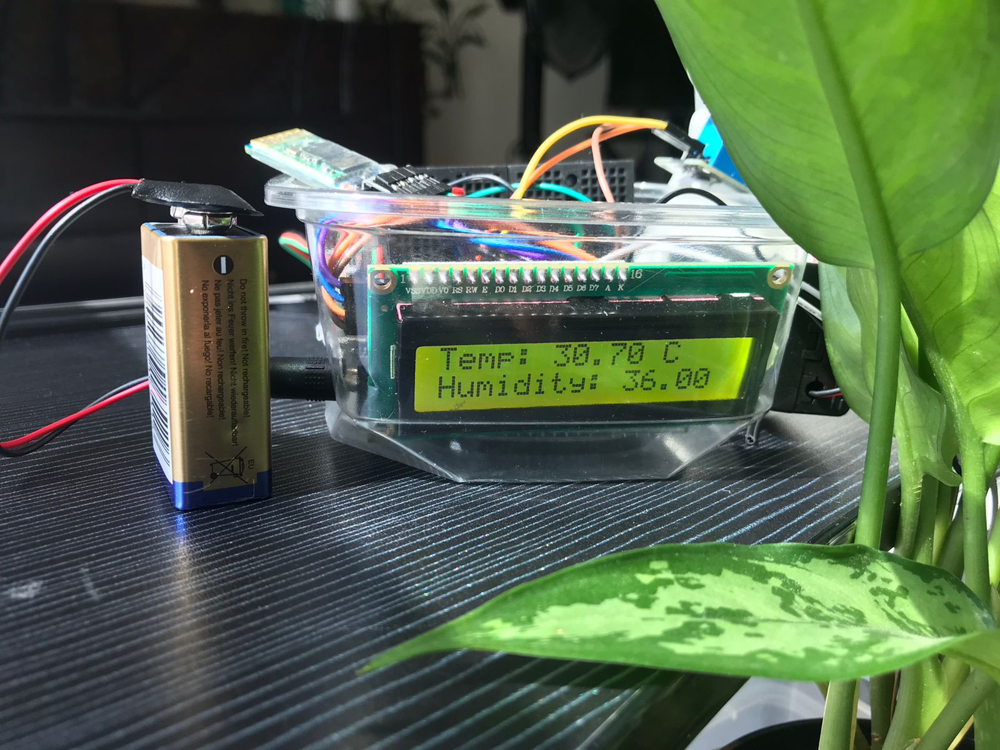
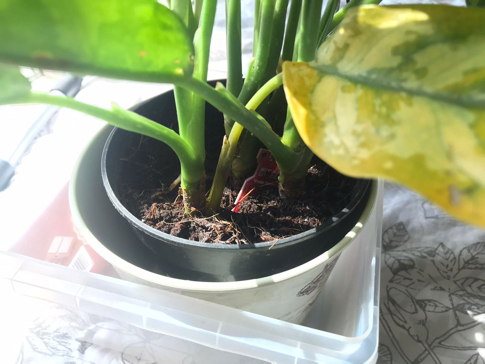
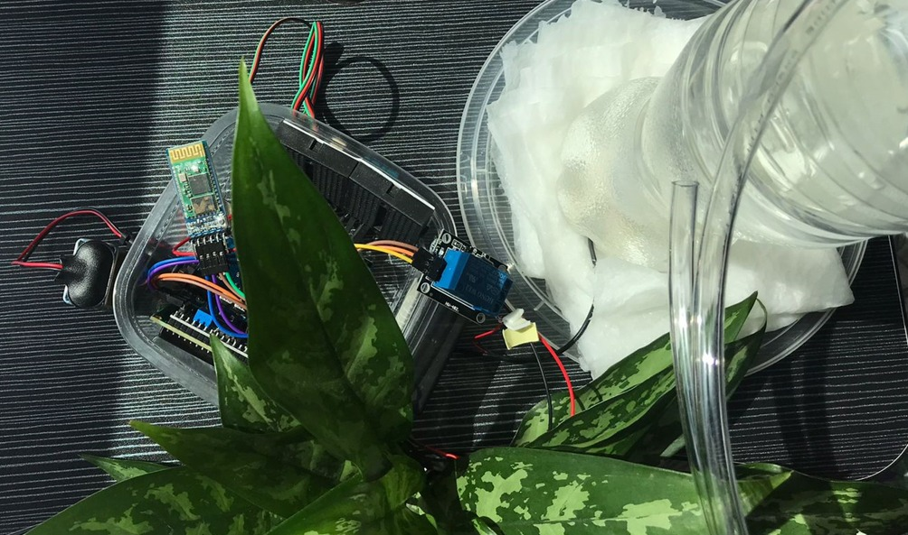

# IoT Plant Care System

## Overview
This project is an IoT-based solution for automated plant care. It monitors soil moisture, temperature, and humidity, and activates a water pump when the soil is dry. The system uses an LCD to display live data and can be controlled via Bluetooth.

  
  
  

## Features
- Monitors soil moisture using an analog sensor.
- Reads temperature and humidity using a DHT11 sensor.
- Displays real-time data on an I2C-connected LCD.
- Activates a water pump automatically when the soil is dry.
- Allows Bluetooth-based communication for remote control.

## Components
- Arduino Uno
- DHT11 Temperature and Humidity Sensor
- Soil Moisture Sensor
- Relay Module
- Water Pump
- HC-05 Bluetooth Module
- 16x2 LCD with I2C Module

## Code Overview
- **Sensors:** Reads soil moisture, temperature, and humidity.
- **LCD Display:** Shows real-time temperature and humidity values.
- **Relay Control:** Activates the water pump when the soil moisture falls below a predefined threshold.
- **Bluetooth Communication:** Monitors and controls via a connected mobile device.

### Key Constants
| Constant  | Description                       | Value   |
|-----------|-----------------------------------|---------|
| `DHTPIN`  | DHT sensor data pin              | `2`     |
| `DHTTYPE` | DHT sensor type                  | `DHT11` |
| `analogPin` | Soil moisture sensor pin        | `A0`    |
| `relayPin` | Relay module control pin        | `3`     |
| `hplmin`  | Min soil moisture threshold      | `350`   |
| `hplmax`  | Max soil moisture threshold      | `716`   |

### App Files

- **Smart_Plant_Care_System.apk**: The compiled Android application ready for installation on devices.
- **Smart_Plant_Care_System.aia**: The source file for the app, created using MIT App Inventor. This file can be imported into [MIT App Inventor](https://appinventor.mit.edu/) for modifications or customizations.

#### How to Use the `.aia` File
1. Go to [MIT App Inventor](https://appinventor.mit.edu/).
2. Log in and click **Projects → Import project (.aia) from my computer**.
3. Select the `Smart_Plant_Care_System.aia` file and import it.
4. Modify the app as needed and compile a new `.apk` if necessary.

## Contributors

This project was developed as a collaborative effort between:
- [Fatimah Munir](https://github.com/Mikaxial)  
- [Abeeha Imran](https://github.com/TechGorlBeea)

We worked together on the design, development, and testing of the IoT-based Smart Plant Care System.

## License

This project is licensed under the MIT License - see the [LICENSE](LICENSE) file for details.

Copyright © 2025 Fatimah Munir and Abeeha Imran
