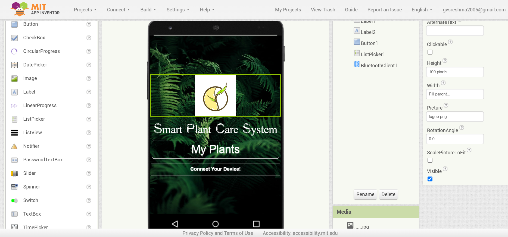

### 🌱 **Smart Plant Care System**  

This project is developed as part of our **Innovation and Design Thinking** course in college. 
It is a **product-based solution** aimed at revolutionizing plant care using **smart technology**.  

##  Overview
The **Smart Plant Care System** is an automated plant monitoring and irrigation system that reads temperature, humidity, and soil moisture levels. It displays the data on an LCD and activates a water pump when the soil moisture falls below a specified threshold. 

## 🌿 Features
- **Soil Moisture Monitoring:** Uses an analog sensor to detect soil moisture levels.
- **Temperature & Humidity Sensing:** Reads environmental conditions using a DHT11 sensor.
- **Real-time Display:** Shows live sensor data on a 16x2 LCD with an I2C module.
- **Automatic Irrigation:** Activates a water pump when the soil moisture is too low.
- **Bluetooth Control:** Allows remote monitoring and control via a mobile app.

## 🔧 Components
- **Microcontroller:** Arduino Uno
- **Sensors:**
  - DHT11 Temperature and Humidity Sensor
  - Soil Moisture Sensor
- **Actuators:**
  - Relay Module
  - Water Pump
- **Communication Module:** HC-05 Bluetooth Module
- **Display:** 16x2 LCD with I2C Module

## 🛠️ Code 
- **Sensors:** Reads soil moisture, temperature, and humidity.
- **LCD Display:** Shows real-time temperature and humidity values.
- **Relay Control:** Activates the water pump when the soil moisture falls below a predefined threshold.
- **Bluetooth Communication:** Enables monitoring and control via a connected mobile device.

## 📱 Mobile App
The system includes a companion Android application for remote control and monitoring:
The compiled Android app ready for installation.
Smart_Plant_Care_System.aia: The source file, created using MIT App Inventor.

##  Installation & Usage
1.  Upload the Arduino code to the Arduino Uno.
2.  Connect all components as per the circuit diagram.
3.  Install `Smart_Plant_Care_System.apk` on an Android device.
4.  Pair the device with the HC-05 Bluetooth module.
5.  Monitor real-time data and control the system remotely via the mobile app.

Stay tuned for updates as we bring this innovative **Smart Plant Care System** to life! 🌍💡 

### 👥 **Team Members:**  

- **Reshma G.V.S.** – 43611113  
- **Reena Sherley** – 43611112  
- **Sri Soundarya** – 4311134  
- **Tshreya** – 43611144  
- **Romitha Anadhan** – 43611116  
- **Janllyn Avanthika** – 43611173

## License

This project is licensed under the MIT License - see the [LICENSE](LICENSE) file for details.

Copyright © 2025 Reshma G.V.S.
